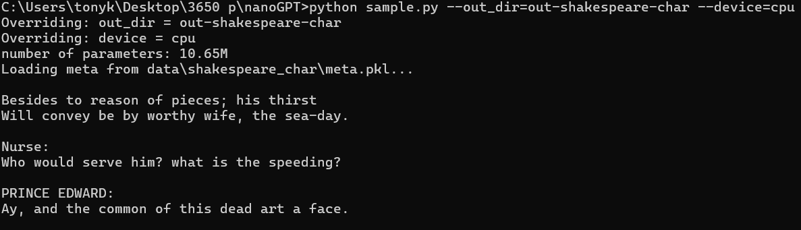
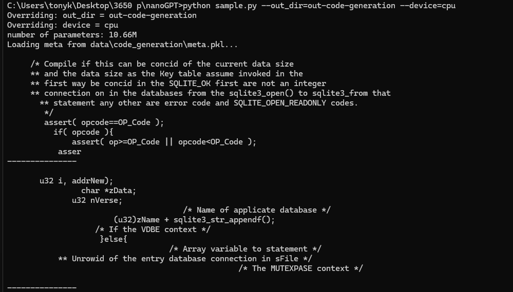

## First 5 lines of the first generated Shakespeare samples are:

Besides to reason of pieces; his thirst\
Will convey be by worthy wife, the sea-day.

Nurse:\
Who would serve him? what is the speeding?

PRINCE EDWARD:




## Model Architecture Exploration
My SID 1155181978(XYZ mod 4 = 2)\
Remainder 2: Layers = 7, Heads ∈ {2, 3, 5, 7}

The validation losses at iteration 40:
- 2 heads: 2.5452
- 3 heads: 2.5456
- 5 heads: 2.5458
- 7 heads: 2.5441

Thus, the lowest validation loss I achieved is 2.5441 with settings:\
Layers = 7 \
Head = 7 \
Iteration = 40

## Training BabyGPT for Code Generation.
My SID 1155181978(XYZ mod 2 = 0)\
Code Generation (C/C++)

First 20 lines of the generated samples:
```c
/* Compile if this can be concid of the current data size
** and the data size as the Key table assume invoked in the
** first way be concid in the SQLITE_OK first are not an integer
** connection on in the databases from the sqlite3_open() to sqlite3_from that
** statement any other are error code and SQLITE_OPEN_READONLY codes.
*/
assert( opcode==OP_Code );
if( opcode ){
    assert( op>=OP_Code || opcode<OP_Code );
    asser
    
    u32 i, addrNew);
    char *zData;
    u32 nVerse;
    /* Name of applicate database */
    (u32)zName + sqlite3_str_appendf();
    /* If the VDBE context */
    }else{
    /* Array variable to statement */
    ** Unrowid of the entry database connection in sFile */
    /* The MUTEXPASE context */
```


My favorite coherent code snippet:
```c
pIter->pNext;
pIter->pNext = pTrue->pNext;
if( pIter->pNext && pIter->apPatter->pNext ){
  assert( pPatter->aNode[pIter->apNext );
     pIter->apNext;
  }
}
}
}

pIter->apPatter[pIter->aiPathOffset = pIter->appList[pIter->zPath];
pIter->azColumn[pIter->apPath->nNext++] = pIter->apPath[pIter->apPath[pIter->aiPaye];
pIter->aiCol[pIter->aiPathOffset] = (int)pIter->aiIdx[iIdx]->aiColumn[ii];
return SQLITE_OK;
```
As it demonstrates how the model has learned C pointer and its manipulation patterns.